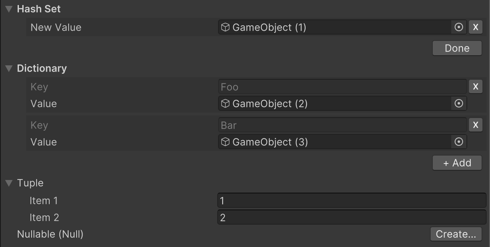

# シリアル化拡張

Dictionaryなどの通常のUnityがシリアル化できない型を編集したい場合、`[AlchemySerialize]`属性を使用してシリアル化を行うことができます。

シリアル化拡張を使用したい場合、[Unity.Serialization](https://docs.unity3d.com/Packages/com.unity.serialization@3.1/manual/index.html)パッケージが必要になります。また、リフレクションを用いたUnity.Serializationのシリアル化はUnity2022.1以前のAOT環境で動作しない可能性があります。詳細はパッケージのマニュアルを確認してください。

以下はAlchemyのシリアル化拡張を用いて様々な型をシリアル化し、Inspectorで編集可能にするサンプルです。

```cs
using System;
using System.Collections.Generic;
using UnityEngine;
using Alchemy.Serialization; // Alchemy.Serialization名前空間をusingに追加

// [AlchemySerialize]属性を付加することでAlchemyのシリアル化拡張が有効化されます。
// 任意の基底クラスを持つ型に使用できますが、SourceGeneratorがコード生成を行うため対象型はpartialである必要があります。
[AlchemySerialize]
public partial class AlchemySerializationExample : MonoBehaviour
{
    // 対象のフィールドに[AlchemySerializeField]属性と[NonSerialized]属性を付加します。
    [AlchemySerializeField, NonSerialized]
    public HashSet<GameObject> hashSet = new();

    [AlchemySerializeField, NonSerialized]
    public Dictionary<string, GameObject> dictionary = new();

    [AlchemySerializeField, NonSerialized]
    public (int, int) tuple;

    [AlchemySerializeField, NonSerialized]
    public Vector3? nullable = null;
}
```



現在Inspectorで編集可能な型は以下の通りです。

* プリミティブ型
* UnityEngine.Object
* AnimationCurve
* Gradient
* 配列
* List<>
* HashSet<>
* Dictionary<,>
* ValueTuple<>
* Nullable<>
* 以上の型のフィールドで構成されるclass/struct

シリアル化の技術的な詳細については[Alchemyのシリアル化プロセス](alchemy-serialization-process.md)を参照してください。